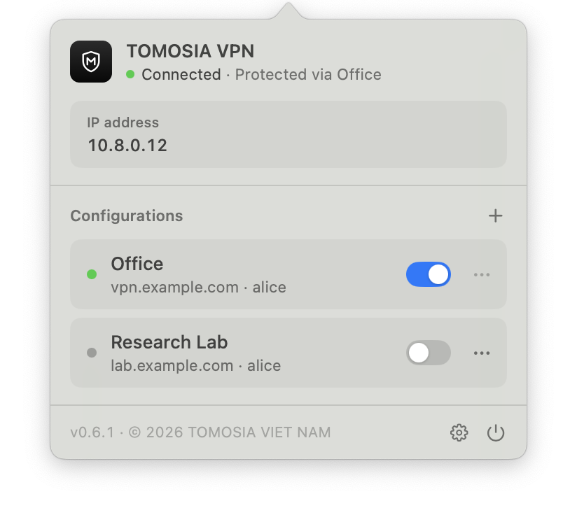

<p align="center">
  
</p>

<h1 align="center">TOMOSIA VPN</h1>

<p align="center">
  <a href="README.md">Tiếng Việt</a> · <b>English</b> · <a href="README.ja.md">日本語</a>
</p>

<p align="center">
  <a href="https://github.com/TOMOSIA-VIETNAM/vpn/releases/latest"></a>
  <a href="https://github.com/TOMOSIA-VIETNAM/vpn/actions/workflows/test.yml"></a>
  
  
  
</p>

<p align="center">
  <picture>
    <source media="(prefers-color-scheme: dark)" srcset="assets/screenshot-dark.png" />
    
  </picture>
</p>

## Install

1. Download [`TOMOSIA-VPN.dmg`](https://github.com/TOMOSIA-VIETNAM/vpn/releases/latest/download/TOMOSIA-VPN.dmg).
2. Open it and drag **TOMOSIA VPN** into **Applications**.
3. Open the app (if macOS blocks it: right-click the app → **Open**).

Requires macOS 12 or later.

## Uninstall

```bash
curl -fsSL https://raw.githubusercontent.com/TOMOSIA-VIETNAM/vpn/main/uninstall.sh | bash
```

---

For developers: [CONTRIBUTING.md](CONTRIBUTING.md).
