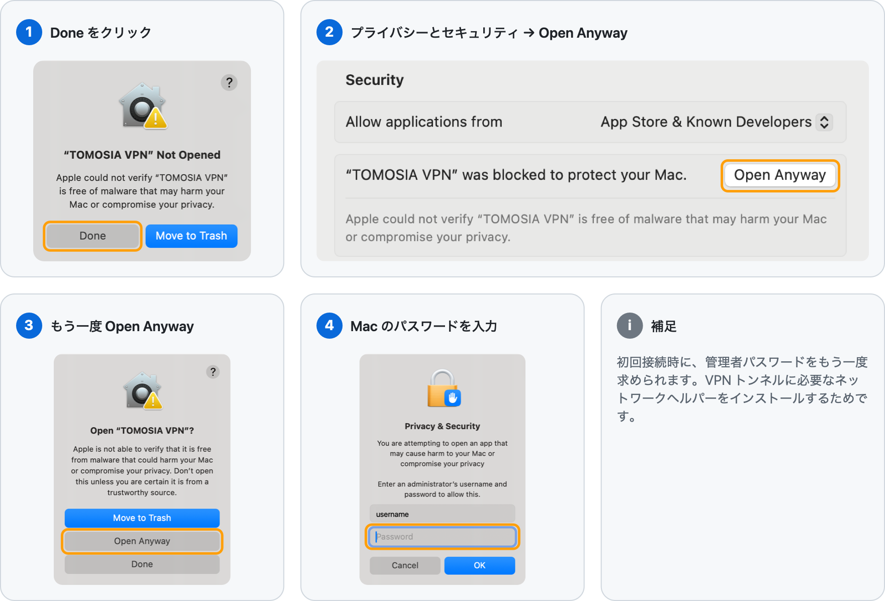

<p align="center">
  
</p>

<h1 align="center">TOMOSIA VPN</h1>

<p align="center">切れても自動でつながる社内 VPN。</p>

<p align="center">
  <a href="https://vpntms.vercel.app/ja"><b>ウェブサイト</b></a>
  &nbsp;·&nbsp;
  <a href="https://github.com/TOMOSIA-VIETNAM/vpn/releases/latest/download/TOMOSIA-VPN.dmg"><b>ダウンロード</b></a>
  &nbsp;·&nbsp;
  <a href="https://github.com/TOMOSIA-VIETNAM/vpn/releases">リリース</a>
  &nbsp;·&nbsp;
  <a href="CONTRIBUTING.md">開発者向け</a>
</p>

<p align="center"><sub><a href="README.md">English</a> · <a href="README.vi.md">Tiếng Việt</a> · <b>日本語</b></sub></p>

<p align="center">
  <a href="https://github.com/TOMOSIA-VIETNAM/vpn/releases/latest"></a>
  <a href="https://github.com/TOMOSIA-VIETNAM/vpn/actions/workflows/test.yml"></a>
  
  
  
</p>

<p align="center">
  <picture>
    <source media="(prefers-color-scheme: dark)" srcset="assets/screenshots/popover-dark.png" />
    
  </picture>
</p>

<p align="center">
  <picture>
    <source media="(prefers-color-scheme: dark)" srcset="assets/screenshots/settings-dark.png" />
    
  </picture>
  <picture>
    <source media="(prefers-color-scheme: dark)" srcset="assets/screenshots/new-configuration-dark.png" />
    
  </picture>
</p>

## インストール

1. [`TOMOSIA-VPN.dmg`](https://github.com/TOMOSIA-VIETNAM/vpn/releases/latest/download/TOMOSIA-VPN.dmg) をダウンロードします。
2. 開いて **TOMOSIA VPN** を **アプリケーション** へドラッグします。
3. アプリを開きます。初回は macOS にブロックされることがあります。下の [macOS にブロックされたら](#macos-にブロックされたら) を参照してください（1 回だけ、1 分もかかりません）。

動作環境：macOS 12 以降。

### macOS にブロックされたら

TOMOSIA VPN は有料の Apple Developer ID で署名されていないため、初回起動は macOS にブロックされます（"Apple could not verify…"）。**App Store と確認済みの開発元** を選んでいても同様です。アプリは安全です。1 回だけ許可してください。

<picture>
  <source media="(prefers-color-scheme: dark)" srcset="assets/screenshots/gatekeeper-steps-ja-dark.png" />
  
</picture>

## アンインストール

```bash
curl -fsSL https://raw.githubusercontent.com/TOMOSIA-VIETNAM/vpn/main/uninstall.sh | bash
```

---

開発者向け：[CONTRIBUTING.md](CONTRIBUTING.md)
