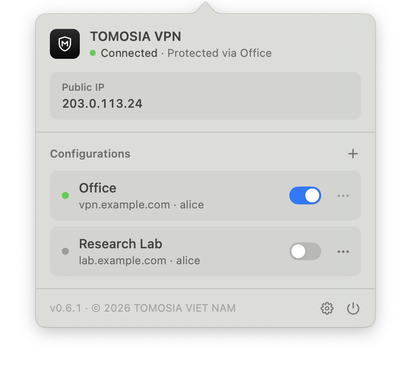
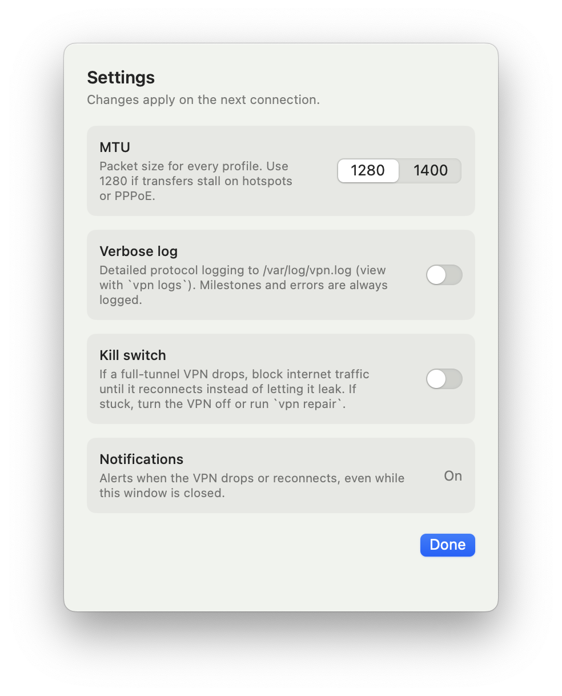
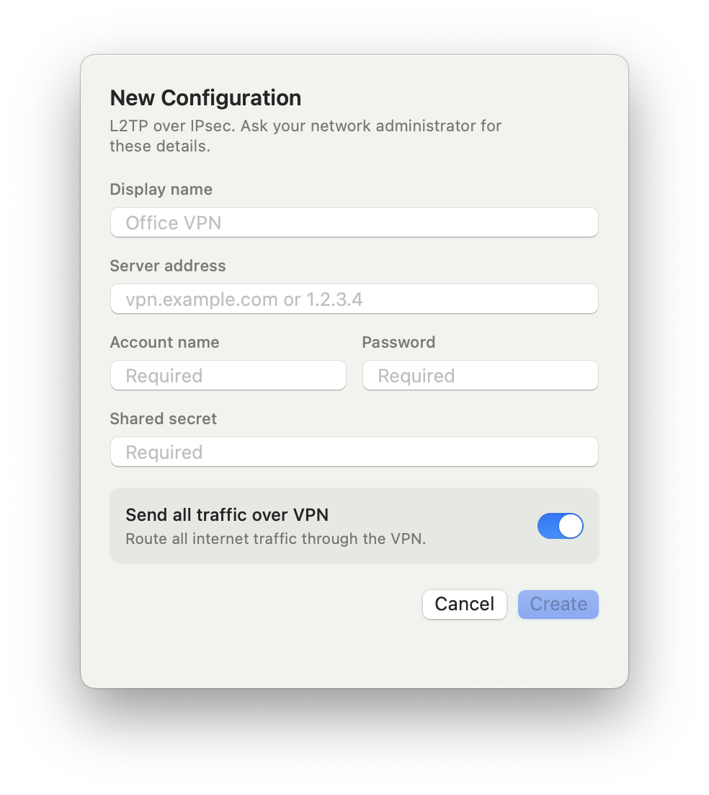

<p align="center">
  
</p>

<h1 align="center">TOMOSIA VPN</h1>

<p align="center">
  <b>Tiếng Việt</b> · <a href="README.en.md">English</a> · <a href="README.ja.md">日本語</a>
</p>

<p align="center">
  <a href="https://github.com/TOMOSIA-VIETNAM/vpn/releases/latest"></a>
  <a href="https://github.com/TOMOSIA-VIETNAM/vpn/actions/workflows/test.yml"></a>
  
  
  
</p>

<p align="center">
  <picture>
    <source media="(prefers-color-scheme: dark)" srcset="assets/screenshots/popover-dark.png" />
    
  </picture>
</p>

<p align="center">
  <picture>
    <source media="(prefers-color-scheme: dark)" srcset="assets/screenshots/settings-dark.png" />
    
  </picture>
  <picture>
    <source media="(prefers-color-scheme: dark)" srcset="assets/screenshots/new-configuration-dark.png" />
    
  </picture>
</p>

## Cài đặt

1. Tải [`TOMOSIA-VPN.dmg`](https://github.com/TOMOSIA-VIETNAM/vpn/releases/latest/download/TOMOSIA-VPN.dmg).
2. Mở file, kéo **TOMOSIA VPN** vào **Applications**.
3. Mở app (nếu macOS chặn: chuột phải vào app → **Open**).

Yêu cầu macOS 12 trở lên.

## Gỡ cài đặt

```bash
curl -fsSL https://raw.githubusercontent.com/TOMOSIA-VIETNAM/vpn/main/uninstall.sh | bash
```

---

Dành cho người phát triển: [CONTRIBUTING.md](CONTRIBUTING.md).
